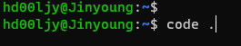
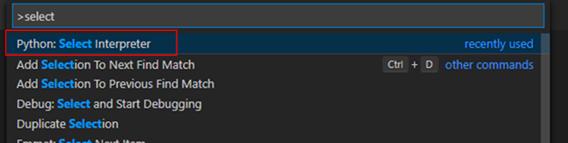
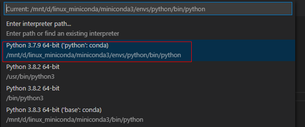
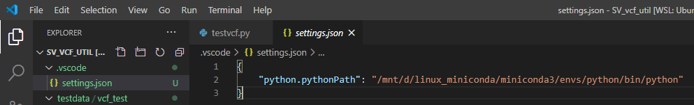
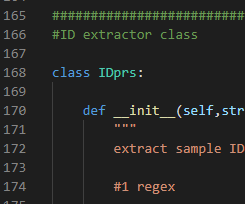
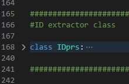

## __1. WSL2 setup WSL2 설치하기__

 - Basic setup - [official docs][MS-WSL2]
 


## __2. Ubuntu apt repo url 변경하기__

 - 기본 url에서 kakao mirror로 변경하는 법은 [이 블로그][apt-kakao]를 참고함


## __3. WSL Ubuntu 상에 python setup - miniconda 활용__

- official docs와는 다르게 pip 대신 miniconda로 virtualenv를 만들어 관리하고자 함.
    - [official docs][vscode-wsl2-python]
- apt update
 ```bash
#update
sudo apt update
```
- miniconda 다운로드
```bash
#miniconda3 python3.8
wget https://repo.anaconda.com/miniconda/Miniconda3-latest-Linux-x86_64.sh
```

 - miniconda 설치
    - miniconda base directory는 용량이 큰 D drive 쪽에 설정함 : /mnt/d/linux_miniconda/miniconda3

```bash

bash Miniconda3-latest-Linux-x86_64.sh

#miniconda3 setting
# Do you accept the license terms? [yes|no]
# [no] >>> yes

# Miniconda3 will now be installed into this location:
# /home/hd00ljy/miniconda3

#   - Press ENTER to confirm the location
#   - Press CTRL-C to abort the installation
#   - Or specify a different location below

# [/home/hd00ljy/miniconda3] >>> /mnt/d/linux_miniconda/miniconda3
# PREFIX=/mnt/d/linux_miniconda/miniconda3
```


- conda base env가 자동으로 켜지지 않도록 설정
```bash
conda config --set auto_activate_base false
```

- python 이라는 이름의 virtualenv 만들기
```bash
conda create -n python
```
- python virtualenv에 들어가서 python 및 필요한 툴들 설치
    - virtual environment 활성화 후 conda install을 통해 설치하면 virtual env 위치를 기본 경로로 모든 툴들이 설치됨 (python 포함)

```bash
conda activate python
conda install -c bioconda pysam pybedtools
conda install numpy scipy
```

## __4. WSL에서 vscode 실행 및 setup__
 - [official docs][vscode-wsl2-python2]
 - wsl2 내에서 vscode 실행 - 아마도 vscode가 windows 쪽에 이미 설치되어있어야 할듯 : [vscode-링크][vscode]

```bash
code .
```



 - Ctrl + Shift + P 누르고 Select 검색, Python: Select Interpreter 선택 


 - 앞서 conda 명령어로 생성한 python virtualenv에 설치된 python을 연결함
 

 - 설정된 python은 현재 project directory에 한정되어 적용되는 것으로 보이는데, 실제로 그러한지는 테스트 해 볼 예정



## __4. 기타 설정__
  - ctrl + enter -> execution & move to next line
     - 기본 설정은 shift + enter 눌렀을 때 해당 라인이 실행되고, 커서는 그대로 남아있음 -> 실행 단축기를 연타하여 코드를 실행하는 방식이 불가능함
     - Ctrl + Enter 설정방법 : [참고링크][ctrl_enter]
        - 이 링크에 나온대로 macros를 활용하면 R studio와 유사하게 ctrl+enter로 코드 라인 실행이 가능함
        - R studio에서 r command 실행할 때 처럼, 코드 일부분을 선택하여 실행 및 점검하는 것이 가능함

   - code block 설정
      - 아무리 찾아봐도 없는듯 ㅠㅠ
      - code block을 collapse해서 실행하는 방법이 그나마 가장 편한듯함.
        - defition 시작부분 왼쪽을 클릭하면 code block이 collapse됨
        
        - collapse된 라인 앞뒤로 선택해서 실행
        

   - (2010929 추가) wsl 용량 증가시키키 : https://docs.microsoft.com/en-us/windows/wsl/vhd-size


[MS-WSL2]:  https://docs.microsoft.com/ko-kr/windows/wsl/install-win10#update-to-wsl-2
[apt-kakao]: https://teddylee777.github.io/linux/ubuntu%EC%97%90%EC%84%9C-apt-get%EC%98%A4%EB%A5%98%EC%8B%9C-mirror%EC%82%AC%EC%9D%B4%ED%8A%B8-%EC%97%85%EB%8D%B0%EC%9D%B4%ED%8A%B8%EB%B0%A9%EB%B2%95
[vscode-wsl2-python]: https://code.visualstudio.com/docs/remote/wsl-tutorial#_python-development
[vscode]: https://code.visualstudio.com/
[vscode-wsl2-python2]: https://code.visualstudio.com/docs/remote/wsl-tutorial#_run-in-wsl
[ctrl_enter]: http://actuarialdatascience.com/shortcut_vscode.html