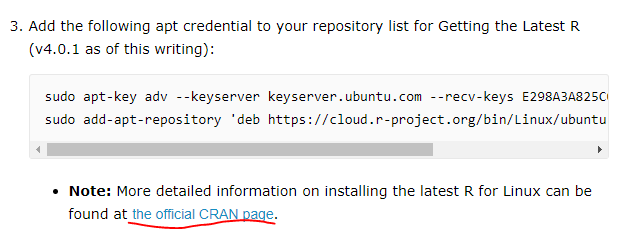

## __1. WSL2 setup : WSL2 설치하기__

 - Basic setup - [official docs][MS-WSL2]
 


## __2. Ubuntu apt repo url 변경하기__

 - 기본 url에서 kakao mirror로 변경하는 법은 [이 블로그][apt-kakao]를 참고함


## __3. WSL Ubuntu 상에 R 및 Rstudio 설치__

 - [official docs][wsl2-rstudio]
 - apt를 통한 R 설치는 R version 4.1 을 설치할 것이므로 위 site에서 추천하는 대로 [official CRAN page][official-CRAN-page]를 참고하여 설치할 것
 
 
    - 내 PC에서 셋업한 방식

```bash
# update indices
sudo apt update -qq
# install two helper packages we need
sudo apt install --no-install-recommends software-properties-common dirmngr
# add the signing key (by Michael Rutter) for these repos
# To verify key, run gpg --show-keys /etc/apt/trusted.gpg.d/cran_ubuntu_key.asc 
# Fingerprint: 298A3A825C0D65DFD57CBB651716619E084DAB9
sudo wget -qO- https://cloud.r-project.org/bin/linux/ubuntu/marutter_pubkey.asc | sudo tee -a /etc/apt/trusted.gpg.d/cran_ubuntu_key.asc
# add the R 4.0 repo from CRAN -- adjust 'focal' to 'groovy' or 'bionic' as needed
sudo add-apt-repository "deb https://cloud.r-project.org/bin/linux/ubuntu $(lsb_release -cs)-cran40/"

sudo apt install --no-install-recommends r-base

sudo add-apt-repository ppa:c2d4u.team/c2d4u4.0+
```

- 그 후 official docs 4번부터 진행


[MS-WSL2]:  https://docs.microsoft.com/ko-kr/windows/wsl/install-win10#update-to-wsl-2
[apt-kakao]: https://teddylee777.github.io/linux/ubuntu%EC%97%90%EC%84%9C-apt-get%EC%98%A4%EB%A5%98%EC%8B%9C-mirror%EC%82%AC%EC%9D%B4%ED%8A%B8-%EC%97%85%EB%8D%B0%EC%9D%B4%ED%8A%B8%EB%B0%A9%EB%B2%95
[vscode-wsl2-python]: https://code.visualstudio.com/docs/remote/wsl-tutorial#_python-development
[vscode]: https://code.visualstudio.com/
[vscode-wsl2-python2]: https://code.visualstudio.com/docs/remote/wsl-tutorial#_run-in-wsl
[ctrl_enter]: http://actuarialdatascience.com/shortcut_vscode.html
[wsl2-rstudio]:https://support.rstudio.com/hc/en-us/articles/360049776974-Using-RStudio-Server-in-Windows-WSL2#rstudio-server-setup
[official-CRAN-page]:https://cran.r-project.org/bin/linux/ubuntu/
