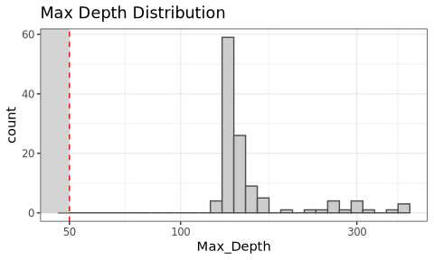
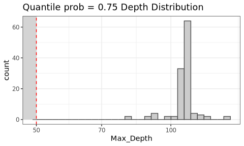
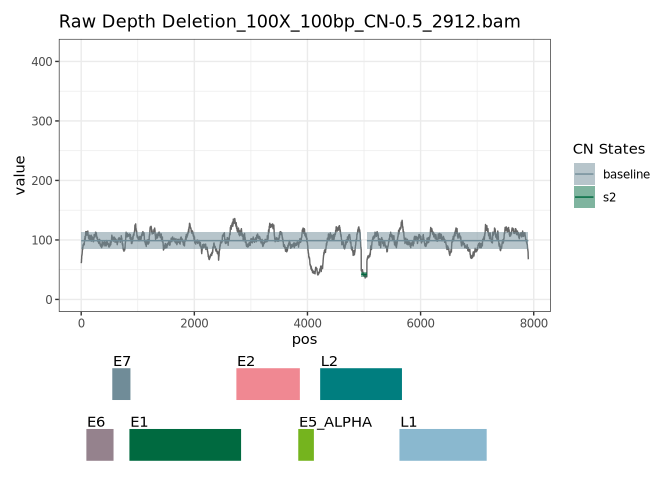
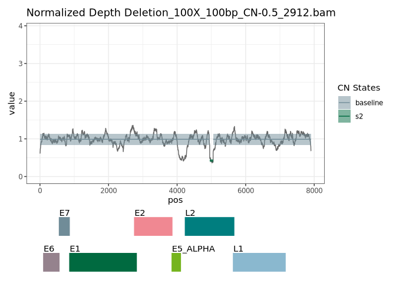
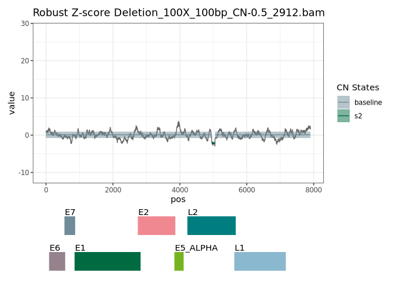
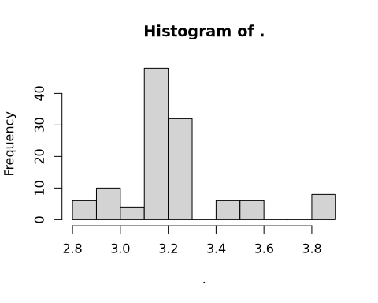
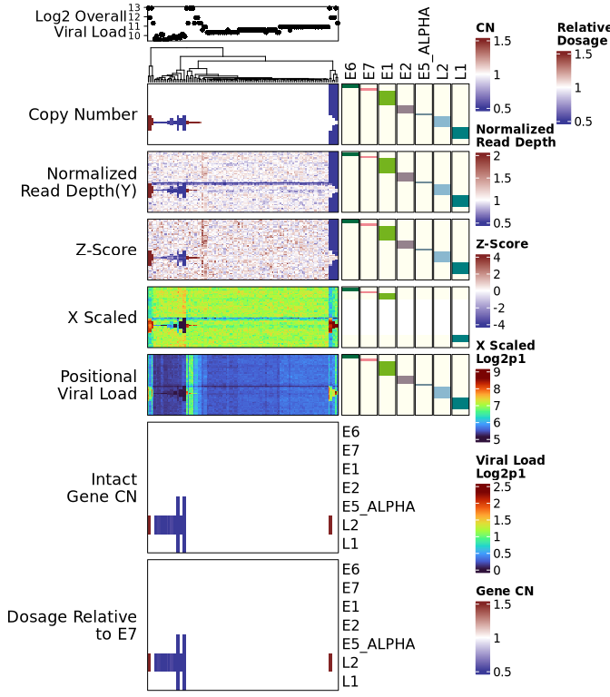

# 1. DESCRIPTION

## 1.1 R Package for Estimating Copy Number Levels of Viral Genome Segments Using Base-Resolution Read Depth Profile

Base-resolution copy number analysis of viral genome. Utilizes base-resolution read depth data over viral genome to find copy number segments with two-dimensional segmentation approach. Provides publish-ready figures, including histograms of read depths, coverage line plots over viral genome annotated with copy number change events and viral genes, and heatmaps showing multiple types of data with integrative clustering of samples.

------------------------------------------------------------------------

# 2. Run Example

## 2.1 Environment Setup and Package Installation


``` r
# Install BiocManager if not already
if (!requireNamespace("BiocManager", quietly = TRUE)) {
    install.packages("BiocManager")
}

# Install devtools if not already
if (!requireNamespace("devtools", quietly = TRUE)) {
    install.packages("devtools")
}

# Ensure repos includes both CRAN and Bioconductor repositories
options(repos = BiocManager::repositories())
devtools::install_github("https://github.com/hyochoi/ELViS.git")
```

## 2.2 Generate Raw Read Depth Matrix with Toy Examples

Load required libraries.


``` r
library(ELViS) 
```


``` r
library(ggplot2)
library(glue)
#> 
#> Attaching package: 'glue'
#> The following object is masked from 'package:ELViS':
#> 
#>     trim
library(dplyr)
#> 
#> Attaching package: 'dplyr'
#> The following objects are masked from 'package:ELViS':
#> 
#>     intersect, setdiff, union
#> The following object is masked from 'package:testthat':
#> 
#>     matches
#> The following object is masked from 'package:desc':
#> 
#>     desc
#> The following objects are masked from 'package:stats':
#> 
#>     filter, lag
#> The following objects are masked from 'package:base':
#> 
#>     intersect, setdiff, setequal, union
library(ComplexHeatmap)
#> Loading required package: grid
#> ========================================
#> ComplexHeatmap version 2.20.0
#> Bioconductor page: http://bioconductor.org/packages/ComplexHeatmap/
#> Github page: https://github.com/jokergoo/ComplexHeatmap
#> Documentation: http://jokergoo.github.io/ComplexHeatmap-reference
#> 
#> If you use it in published research, please cite either one:
#> - Gu, Z. Complex Heatmap Visualization. iMeta 2022.
#> - Gu, Z. Complex heatmaps reveal patterns and correlations in multidimensional 
#>     genomic data. Bioinformatics 2016.
#> 
#> 
#> The new InteractiveComplexHeatmap package can directly export static 
#> complex heatmaps into an interactive Shiny app with zero effort. Have a try!
#> 
#> This message can be suppressed by:
#>   suppressPackageStartupMessages(library(ComplexHeatmap))
#> ========================================
theme_set(theme_bw())
```


Prepare BAM file name vector.


``` r
analysis_dir = "~/ELViS"
dir.create(analysis_dir,showWarnings = FALSE)

package_name = "ELViS"

# load toy example meta data
data(toy_example,package = package_name)

# get lust of bam file paths
ext_path = system.file("extdata",package = package_name)
bam_files = list.files(ext_path,full.names = TRUE,pattern = "bam$")

```

Generate base-resolution read depth matrix from a list of BAM files. Parallel package is used to read BAM files fast.


``` r
 os_name = Sys.info()["sysname"]
if( os_name == "Windows" ){
  N_cores <- 1L
}else{
  N_cores <- 2L
}


# the name of the reference viral sequence the reads were aligned to
target_virus_name = "gi|333031|lcl|HPV16REF.1|"

# temporary file directory
tmpdir="./tmpdir"
dir.create(tmpdir,recursive = TRUE)

# generate read depth matrix
system.time({
mtrx_samtools_reticulate__example = 
  get_depth_matrix(
    bam_files = bam_files,target_virus_name = target_virus_name
    ,mode = "samtools_reticulate"
    ,N_cores = N_cores
    ,min_mapq = 30
    ,tmpdir=tmpdir
    ,condaenv = "env_samtools"
    ,conda = "auto"
    ,remove_tmpdir = TRUE
  )
})
#> Conda is already installed at: /nfs/home/jlee307/.local/share/r-miniconda/bin/conda
#> Warning in dir.create(tmpdir): './tmpdir' already exists
#>    user  system elapsed 
#>   0.500   0.162   1.933

# remove temporary directory
unlink(tmpdir,recursive=TRUE)

```


## 2.3 Filtering Out Low Depth Samples

Determine sample filtering threshold using histogram and filter out low depth samples


``` r
# loading precalculated depth matrix
data(mtrx_samtools_reticulate)

# threshold
th = 50
# histogram with adjustable thresholds for custom function
depth_hist(mtrx_samtools_reticulate,th=th,smry_fun=max)
#> Warning in scale_x_continuous(trans = "log10"): log-10 transformation
#> introduced infinite values.
#> `stat_bin()` using `bins = 30`. Pick better value with `binwidth`.
```

<!-- -->

``` r
depth_hist(mtrx_samtools_reticulate,th=th,smry_fun=quantile,prob=0.75)
#> Warning in scale_x_continuous(trans = "log10"): log-10 transformation
#> introduced infinite values.
#> `stat_bin()` using `bins = 30`. Pick better value with `binwidth`.
```

<!-- -->

``` r

# filtered matrix
base_resol_depth = filt_samples(mtrx_samtools_reticulate,th=th,smry_fun=max)
print(base_resol_depth[1:4,1:4])
#>      Control_100X_58.bam Control_100X_61.bam Control_100X_64.bam
#> [1,]                  55                  57                  60
#> [2,]                  56                  59                  62
#> [3,]                  57                  61                  62
#> [4,]                  57                  61                  63
#>      Control_100X_83.bam
#> [1,]                  49
#> [2,]                  49
#> [3,]                  52
#> [4,]                  53

# save data for later use
saveRDS(base_resol_depth,"~/base_resol_depth.rds")
```


## 2.4 Run ELViS using the Filtered Depth Matrix

Running ELViS using the filtered read depth matrix(`base_resol_depth`).


``` r
system.time({
  result = run_ELViS(
    X = base_resol_depth
    ,N_cores=N_cores
    ,reduced_output=TRUE
    )
 
})

ELViS_toy_run_result = result
use_data(ELViS_toy_run_result)

# 4min for 120 samples using 10 threads
```

## 2.5 Plotting Figures

Prepare plotting data


``` r
# ELViS run result
data(ELViS_toy_run_result)
result = ELViS_toy_run_result

# Directory where figures will be saved
figure_dir = glue("{analysis_dir}/figures")
dir.create(figure_dir)
#> Warning in dir.create(figure_dir): '/nfs/home/jlee307/ELViS/figures'
#> already exists

# give the gff3 file of the virus of your interest. Sequence name or chromosome name should match with that in the reference genome FASTA file.
gff3_fn = system.file("extdata","HPV16REF_PaVE.gff",package = package_name)
```

Raw read depth profile line plots.


``` r
# Plotting raw depth profile
gg_lst_x = 
  plot_pileUp_multisample(
    result = result,
    X_raw = base_resol_depth,
    plot_target = "x",
    gff3 = gff3_fn,
    baseline=1,
    exclude_genes = c("E6*","E1^E4","E8^E2"),
  )
#> Import genomic features from the file as a GRanges object ...
#> Warning in .local(con, format, text, ...): gff-version directive
#> indicates version is 3.1.26, not 3
#> OK
#> Prepare the 'metadata' data frame ... OK
#> Make the TxDb object ...
#> Warning in .extract_transcripts_from_GRanges(tx_IDX, gr, mcols0$type, mcols0$ID, : the transcript names ("tx_name" column in the TxDb object)
#>   imported from the "Name" attribute are not unique
#> OK

# Save to pdf file, set SKIP = FALSE if you want to save as pdf
SKIP = TRUE
if(!SKIP){
  pdf(glue("{figure_dir}/Raw_Depth_CNV_call.pdf"),height=4,width=6)
  gg_lst_x
  dev.off()
}

# an example of raw read depth line plot
print(gg_lst_x[[1]])
```

<!-- -->

You can adjust baseline after examining depth profile plots.


``` r
# set the longest segment as a new baseline
new_baseline = get_new_baseline(result,mode="longest")

# Plotting raw depth profile with new baseline
gg_lst_x = 
  plot_pileUp_multisample(
    result = result,
    X_raw = base_resol_depth,
    plot_target = "x",
    gff3 = gff3_fn,
    baseline=new_baseline,
    exclude_genes = c("E6*","E1^E4","E8^E2"),
  )
# Save to pdf file, set SKIP = FALSE if you want to save as pdf
SKIP = TRUE
if(!SKIP){
  # Save to pdf file
  pdf("figures/Raw_Depth_new_baseline_CNV_call.pdf",height=4,width=6)
  gg_lst_x
  dev.off()
}

# an example of raw read depth line plot with new baseline
gg_lst_x[[1]]
```

<!-- -->

Normalized read depth profile line plots.


``` r
# Plotting normalized depth profile
gg_lst_y = 
  plot_pileUp_multisample(
    result = result,
    X_raw = base_resol_depth,
    plot_target = "y",
    gff3 = gff3_fn,
    baseline=new_baseline,
    exclude_genes = c("E6*","E1^E4","E8^E2"),
  )

# Save to pdf file
SKIP = TRUE
if(!SKIP){
  pdf("figures/Normalized_Depth_CNV_call.pdf",height=4,width=6)
  gg_lst_y
  dev.off()
}

# an example of normalized read depth line plot with new baseline
gg_lst_y[[1]]
```

<!-- -->


Robust Z-score profile line plots.


``` r
# Plotting robust Z-score profile
gg_lst_z = 
  plot_pileUp_multisample(
    result = result,
    X_raw = base_resol_depth,
    plot_target = "z",
    gff3 = gff3_fn,
    baseline=new_baseline,
    exclude_genes = c("E6*","E1^E4","E8^E2")
  )

SKIP = TRUE
if(!SKIP){
# Save to pdf file
pdf("figures/Robust-Z-score_CNV_call.pdf",height=4,width=6)
gg_lst_z
dev.off()
}

# an example of Z-score line plot with new baseline
gg_lst_z[[1]]
```

<!-- -->

Generating heatmaps with integrative clustering.


Calculation of viral loads.
 - Get total aligned base using tools such as picard. Here we use randomly generated numbers instead.
 

 
 

``` r
data(total_aligned_base__host_and_virus)

viral_load = (10^6)*(apply(base_resol_depth,2,\(x) sum(x)) )/total_aligned_base__host_and_virus

# distribtuion of overall viral load
viral_load %>%log10 %>% hist
```

<!-- -->


Generate heatmaps with integrative clustering using data transformed in various ways.


``` r
exclude_genes = c("E6*","E1^E4","E8^E2")
integ_ht_result = integrative_heatmap(
  X_raw = base_resol_depth,
  result = result,
  gff3_fn = gff3_fn,
  exclude_genes = exclude_genes,
  # baseline = new_baseline,
  baseline=1,
  # col_z = col_z,
  total_aligned_base__host_and_virus = total_aligned_base__host_and_virus
)
#> Import genomic features from the file as a GRanges object ...
#> Warning in .local(con, format, text, ...): gff-version directive
#> indicates version is 3.1.26, not 3
#> OK
#> Prepare the 'metadata' data frame ... OK
#> Make the TxDb object ...
#> Warning in .extract_transcripts_from_GRanges(tx_IDX, gr, mcols0$type, mcols0$ID, : the transcript names ("tx_name" column in the TxDb object)
#>   imported from the "Name" attribute are not unique
#> OK
#> Import genomic features from the file as a GRanges object ...
#> Warning in .local(con, format, text, ...): gff-version directive
#> indicates version is 3.1.26, not 3
#> OK
#> Prepare the 'metadata' data frame ... OK
#> Make the TxDb object ...
#> Warning in .extract_transcripts_from_GRanges(tx_IDX, gr, mcols0$type, mcols0$ID, : the transcript names ("tx_name" column in the TxDb object)
#>   imported from the "Name" attribute are not unique
#> OK
#> `use_raster` is automatically set to TRUE for a matrix with
#> more than 2000 rows. You can control `use_raster` argument by
#> explicitly setting TRUE/FALSE to it.
#> 
#> Set `ht_opt$message = FALSE` to turn off this message.
#> 'magick' package is suggested to install to give better
#> rasterization.
#> 
#> Set `ht_opt$message = FALSE` to turn off this message.
#> Warning: The input is a data frame-like object, convert it to a matrix.
#> `use_raster` is automatically set to TRUE for a matrix with
#> more than 2000 rows. You can control `use_raster` argument by
#> explicitly setting TRUE/FALSE to it.
#> 
#> Set `ht_opt$message = FALSE` to turn off this message.
#> 'magick' package is suggested to install to give better
#> rasterization.
#> 
#> Set `ht_opt$message = FALSE` to turn off this message.
#> `use_raster` is automatically set to TRUE for a matrix with
#> more than 2000 rows. You can control `use_raster` argument by
#> explicitly setting TRUE/FALSE to it.
#> 
#> Set `ht_opt$message = FALSE` to turn off this message.
#> 'magick' package is suggested to install to give better
#> rasterization.
#> 
#> Set `ht_opt$message = FALSE` to turn off this message.
#> `use_raster` is automatically set to TRUE for a matrix with
#> more than 2000 rows. You can control `use_raster` argument by
#> explicitly setting TRUE/FALSE to it.
#> 
#> Set `ht_opt$message = FALSE` to turn off this message.
#> 'magick' package is suggested to install to give better
#> rasterization.
#> 
#> Set `ht_opt$message = FALSE` to turn off this message.
#> `use_raster` is automatically set to TRUE for a matrix with
#> more than 2000 rows. You can control `use_raster` argument by
#> explicitly setting TRUE/FALSE to it.
#> 
#> Set `ht_opt$message = FALSE` to turn off this message.
#> 'magick' package is suggested to install to give better
#> rasterization.
#> 
#> Set `ht_opt$message = FALSE` to turn off this message.
#> Warning: The input is a data frame-like object, convert it to a matrix.
#> `use_raster` is automatically set to TRUE for a matrix with
#> more than 2000 rows. You can control `use_raster` argument by
#> explicitly setting TRUE/FALSE to it.
#> 
#> Set `ht_opt$message = FALSE` to turn off this message.
#> 'magick' package is suggested to install to give better
#> rasterization.
#> 
#> Set `ht_opt$message = FALSE` to turn off this message.
#> Warning: The heatmap has not been initialized. You might have different
#> results if you repeatedly execute this function, e.g. when
#> row_km/column_km was set. It is more suggested to do as `ht =
#> draw(ht); column_order(ht)`.

# top annotation
top_ant =
  HeatmapAnnotation(
    `Log2 Overall\nViral Load` = anno_points(log2(viral_load)),
    annotation_name_side = "left",annotation_name_rot=0)
```


Generate heatmap showing maximum number of intact copies
 - min copy of the overlapping copy segments
 - ratio relative to certain gene(`gene_ref`)


``` r
gene_ref="E7"

gene_cn = 
  gene_cn_heatmaps(
  X_raw = base_resol_depth,
  result = result,
  gff3_fn = gff3_fn,
  baseline = new_baseline,
  # baseline = 1,
  gene_ref = gene_ref,
  exclude_genes = exclude_genes
)
#> Import genomic features from the file as a GRanges object ...
#> Warning in .local(con, format, text, ...): gff-version directive
#> indicates version is 3.1.26, not 3
#> OK
#> Prepare the 'metadata' data frame ... OK
#> Make the TxDb object ...
#> Warning in .extract_transcripts_from_GRanges(tx_IDX, gr, mcols0$type, mcols0$ID, : the transcript names ("tx_name" column in the TxDb object)
#>   imported from the "Name" attribute are not unique
#> OK
```

Generate final heatmap in a single panel.


``` r
draw(top_ant %v% integ_ht_result$Heatmap %v% gene_cn$Heatmaps$intact_gene_cn %v% gene_cn$Heatmaps$rel_dosage)
```

<!-- -->

``` r
# minCN_mtrx %>%
#   dplyr::select(contains("6258"))

# integ_ht_result$Heatmap[,1:3]
```


------------------------------------------------------------------------

# 3. sessionInfo


``` r
sessionInfo()
#> R version 4.4.1 (2024-06-14)
#> Platform: x86_64-conda-linux-gnu
#> Running under: Red Hat Enterprise Linux 8.9 (Ootpa)
#> 
#> Matrix products: default
#> BLAS/LAPACK: /lustre/isaac/scratch/jlee307/miniforge3/envs/R_rstudio20241029/lib/libopenblasp-r0.3.28.so;  LAPACK version 3.12.0
#> 
#> locale:
#>  [1] LC_CTYPE=en_US.UTF-8       LC_NUMERIC=C              
#>  [3] LC_TIME=en_US.UTF-8        LC_COLLATE=en_US.UTF-8    
#>  [5] LC_MONETARY=en_US.UTF-8    LC_MESSAGES=en_US.UTF-8   
#>  [7] LC_PAPER=en_US.UTF-8       LC_NAME=C                 
#>  [9] LC_ADDRESS=C               LC_TELEPHONE=C            
#> [11] LC_MEASUREMENT=en_US.UTF-8 LC_IDENTIFICATION=C       
#> 
#> time zone: America/New_York
#> tzcode source: system (glibc)
#> 
#> attached base packages:
#> [1] grid      stats     graphics  grDevices utils     datasets 
#> [7] methods   base     
#> 
#> other attached packages:
#> [1] ComplexHeatmap_2.20.0 dplyr_1.1.4           glue_1.8.0           
#> [4] ggplot2_3.5.1         ELViS_0.99.0          testthat_3.2.1.1     
#> [7] desc_1.4.3            devtools_2.4.5        usethis_3.0.0        
#> 
#> loaded via a namespace (and not attached):
#>   [1] later_1.3.2                 BiocIO_1.14.0              
#>   [3] bitops_1.0-9                filelock_1.0.3             
#>   [5] R.oo_1.26.0                 tibble_3.2.1               
#>   [7] graph_1.82.0                XML_3.99-0.17              
#>   [9] lifecycle_1.0.4             httr2_1.0.5                
#>  [11] doParallel_1.0.17           rprojroot_2.0.4            
#>  [13] processx_3.8.4              lattice_0.22-6             
#>  [15] magrittr_2.0.3              sass_0.4.9                 
#>  [17] rmarkdown_2.28              jquerylib_0.1.4            
#>  [19] yaml_2.3.10                 remotes_2.5.0              
#>  [21] httpuv_1.6.15               sessioninfo_1.2.2          
#>  [23] pkgbuild_1.4.5              RUnit_0.4.33               
#>  [25] reticulate_1.39.0           DBI_1.2.3                  
#>  [27] RColorBrewer_1.1-3          abind_1.4-8                
#>  [29] pkgload_1.4.0               zlibbioc_1.50.0            
#>  [31] R.cache_0.16.0              GenomicRanges_1.56.2       
#>  [33] R.utils_2.12.3              purrr_1.0.2                
#>  [35] BiocGenerics_0.50.0         RCurl_1.98-1.16            
#>  [37] styler_1.10.3               rappdirs_0.3.3             
#>  [39] circlize_0.4.16             GenomeInfoDbData_1.2.12    
#>  [41] IRanges_2.38.1              S4Vectors_0.42.1           
#>  [43] gitcreds_0.1.2              commonmark_1.9.2           
#>  [45] codetools_0.2-20            DelayedArray_0.30.1        
#>  [47] xml2_1.3.6                  tidyselect_1.2.1           
#>  [49] shape_1.4.6.1               UCSC.utils_1.0.0           
#>  [51] farver_2.1.2                matrixStats_1.4.1          
#>  [53] stats4_4.4.1                BiocFileCache_2.12.0       
#>  [55] roxygen2_7.3.2              segclust2d_0.3.3           
#>  [57] GenomicAlignments_1.40.0    jsonlite_1.8.9             
#>  [59] GetoptLong_1.0.5            ellipsis_0.3.2             
#>  [61] iterators_1.0.14            foreach_1.5.2              
#>  [63] tools_4.4.1                 progress_1.2.3             
#>  [65] stringdist_0.9.12           Rcpp_1.0.13                
#>  [67] SparseArray_1.4.8           BiocBaseUtils_1.6.0        
#>  [69] xfun_0.48                   MatrixGenerics_1.16.0      
#>  [71] GenomeInfoDb_1.40.1         withr_3.0.2                
#>  [73] BiocManager_1.30.25         fastmap_1.2.0              
#>  [75] xopen_1.0.1                 fansi_1.0.6                
#>  [77] callr_3.7.6                 digest_0.6.37              
#>  [79] rcmdcheck_1.4.0             R6_2.5.1                   
#>  [81] mime_0.12                   colorspace_2.1-1           
#>  [83] biomaRt_2.60.1              RSQLite_2.3.7              
#>  [85] R.methodsS3_1.8.2           utf8_1.2.4                 
#>  [87] generics_0.1.3              data.table_1.16.2          
#>  [89] rtracklayer_1.64.0          prettyunits_1.2.0          
#>  [91] httr_1.4.7                  htmlwidgets_1.6.4          
#>  [93] S4Arrays_1.4.1              whisker_0.4.1              
#>  [95] pkgconfig_2.0.3             gtable_0.3.6               
#>  [97] blob_1.2.4                  XVector_0.44.0             
#>  [99] brio_1.1.5                  htmltools_0.5.8.1          
#> [101] profvis_0.4.0               RBGL_1.80.0                
#> [103] clue_0.3-65                 scales_1.3.0               
#> [105] Biobase_2.64.0              png_0.1-8                  
#> [107] biocthis_1.14.0             knitr_1.48                 
#> [109] rstudioapi_0.17.1           rjson_0.2.23               
#> [111] uuid_1.2-1                  curl_5.2.3                 
#> [113] biocViews_1.72.0            cachem_1.1.0               
#> [115] zoo_1.8-12                  GlobalOptions_0.1.2        
#> [117] stringr_1.5.1               parallel_4.4.1             
#> [119] miniUI_0.1.1.1              AnnotationDbi_1.66.0       
#> [121] restfulr_0.0.15             pillar_1.9.0               
#> [123] vctrs_0.6.5                 urlchecker_1.0.1           
#> [125] promises_1.3.0              dbplyr_2.5.0               
#> [127] xtable_1.8-4                cluster_2.1.6              
#> [129] evaluate_1.0.1              GenomicFeatures_1.56.0     
#> [131] cli_3.6.3                   compiler_4.4.1             
#> [133] Rsamtools_2.20.0            rlang_1.1.4                
#> [135] crayon_1.5.3                labeling_0.4.3             
#> [137] ps_1.8.1                    fs_1.6.4                   
#> [139] stringi_1.8.4               viridisLite_0.4.2          
#> [141] BiocParallel_1.38.0         BiocCheck_1.40.0           
#> [143] txdbmaker_1.0.1             munsell_0.5.1              
#> [145] Biostrings_2.72.1           Matrix_1.7-1               
#> [147] hms_1.1.3                   patchwork_1.3.0            
#> [149] bit64_4.5.2                 KEGGREST_1.44.1            
#> [151] shiny_1.9.1                 highr_0.11                 
#> [153] SummarizedExperiment_1.34.0 igraph_2.1.1               
#> [155] memoise_2.0.1               bslib_0.8.0                
#> [157] bit_4.5.0
```
